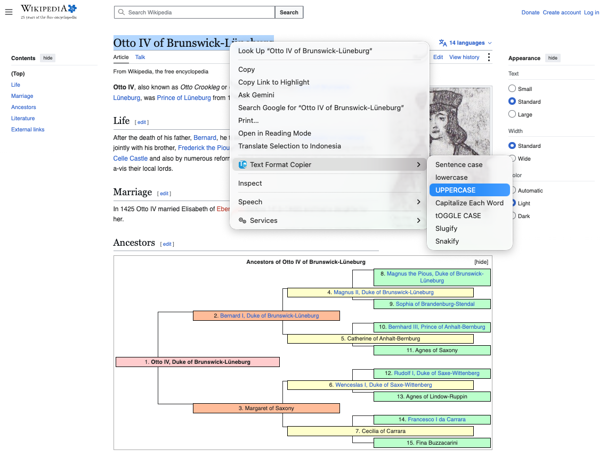

# Text Format Copier (Chrome Extension)

A Chrome extension that converts selected text using the right-click context menu and automatically copies the transformed result to the clipboard.

## Features

### 1. Sentence case
Converts the text into a standard sentence format.
- Example: `hello world` -> `Hello world`
- Example: `this is a test. another one` -> `This is a test. Another one`

### 2. lowercase
Converts all characters to lowercase.
- Example: `TEXT FORMAT COPIER APP` -> `text format copier app`

### 3. UPPERCASE
Converts all characters to uppercase.
- Example: `text format copier app` -> `TEXT FORMAT COPIER APP`

### 4. Capitalize Each Word
Capitalizes the first letter of each word.
- Example: `text format copier app` -> `Text Format Copier App`

### 5. tOGGLE CASE
Changes uppercase to lowercase and lowercase to uppercase for each letter.
- Example: `Text Format Copier` -> `tEXT fORMAT cOPIER`

### 6. Slugify
Converts text into a URL-friendly slug.
- Example: `Text Format Copier - a great tool` -> `text-format-copier-a-great-tool`
- Removes symbols, converts spaces to hyphens, and lowercases the result.

### 7. Snakify
Converts text into snake_case format.
- Example: `Text Format Copier is a great tool` -> `text_format_copier_is_a_great_tool`
- Lowercases all letters and replaces spaces with underscores.

## How to install
1. Download this project as a ZIP file from GitHub or from the latest **Releases** page, then extract it.
2. Open `chrome://extensions`.
3. Enable **Developer mode**.
4. Click **Load unpacked**.
5. Select the extracted project folder.
6. The extension will appear in the Chrome extension list.

## How to use
1. Open any webpage in Chrome.
2. Select the text you want to transform.
3. Right-click the selected text.
4. Choose **Text Format Copier** from the context menu.
5. Select the desired case mode.
6. The converted text is copied to your clipboard automatically.
7. Paste it anywhere with `Cmd + V` on macOS or `Ctrl + V` on Windows.

## Screenshot

This extension appears in the browser context menu when text is selected. Users can right-click the selection, choose the conversion option, and the transformed text is copied to the clipboard immediately.

Current version: `1.0.0`

## Privacy Policy

This extension does not collect or store user data. For details, see [privacy-policy.md](./privacy-policy.md).

## Notes
- This extension uses Manifest V3.
- It works on normal web pages using `http://`, `https://`, and `file://` URLs.
- Internal Chrome pages such as `chrome://` are not supported because Chrome restricts script execution there.

---

# Text Format Copier (Chrome Extension)

Ekstensi Chrome yang dapat mengubah teks yang dipilih melalui menu klik kanan dan secara otomatis menyalin hasilnya ke clipboard.

## Fitur

### 1. Sentence case
Mengubah teks menjadi format kalimat standar.
- Contoh: `hello world` -> `Hello world`
- Contoh: `ini adalah contoh. kalimat lain` -> `Ini adalah contoh. Kalimat lain`

### 2. lowercase
Mengubah semua huruf menjadi huruf kecil.
- Contoh: `TEXT FORMAT COPIER APP` -> `text format copier app`

### 3. UPPERCASE
Mengubah semua huruf menjadi huruf besar.
- Contoh: `text format copier app` -> `TEXT FORMAT COPIER APP`

### 4. Capitalize Each Word
Mengubah huruf awal setiap kata menjadi kapital.
- Contoh: `text format copier app` -> `Text Format Copier App`

### 5. tOGGLE CASE
Mengubah huruf besar menjadi kecil dan huruf kecil menjadi besar pada setiap huruf.
- Contoh: `Text Format Copier` -> `tEXT fORMAT cOPIER`

### 6. Slugify
Mengubah teks menjadi format slug yang ramah untuk URL.
- Contoh: `Text Format Copier - a great tool` -> `text-format-copier-a-great-tool`
- Menghapus karakter khusus, mengganti spasi menjadi tanda hubung, dan membuat semua huruf kecil.

### 7. Snakify
Mengubah teks menjadi format snake_case.
- Contoh: `Text Format Copier is a great tool` -> `text_format_copier_is_a_great_tool`
- Mengubah semua huruf menjadi kecil dan mengganti spasi dengan underscore.

## Cara install
1. Unduh project ini sebagai file ZIP dari GitHub atau dari halaman **Rilis** terbaru, lalu ekstrak.
2. Buka `chrome://extensions`.
3. Aktifkan **Developer mode**.
4. Klik **Load unpacked**.
5. Pilih folder project hasil ekstrak.
6. Ekstensi akan muncul di daftar ekstensi Chrome.

## Cara pakai
1. Buka halaman web apa saja di Chrome.
2. Pilih teks yang ingin diubah.
3. Klik kanan pada teks yang dipilih.
4. Pilih submenu **Text Format Copier**.
5. Pilih format yang diinginkan.
6. Teks hasil konversi otomatis tersalin ke clipboard.
7. Paste hasilnya ke tempat yang Anda inginkan dengan `Cmd + V` di macOS atau `Ctrl + V` di Windows.

## Screenshot

Ekstensi ini muncul di menu klik kanan saat teks dipilih. Pengguna cukup klik kanan, pilih format konversi yang diinginkan, lalu teks hasil transformasi otomatis tersalin ke clipboard.

## Privacy Policy

Ekstensi ini tidak mengumpulkan atau menyimpan data pengguna. Untuk detailnya, lihat [privacy-policy.md](./privacy-policy.md).

## Catatan
- Ekstensi ini menggunakan Manifest V3.
- Ekstensi bekerja pada halaman web normal seperti `http://`, `https://`, dan `file://`.
- Halaman internal Chrome seperti `chrome://` tidak didukung karena Chrome membatasi eksekusi skrip di halaman tersebut.
